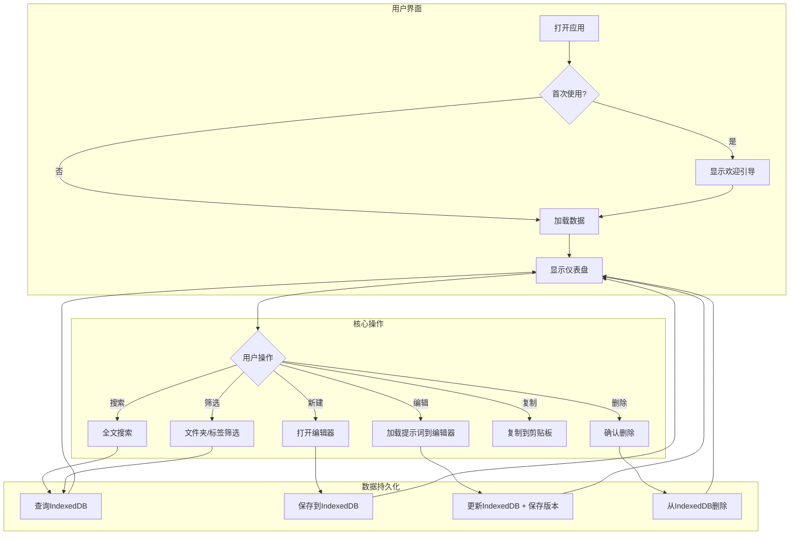
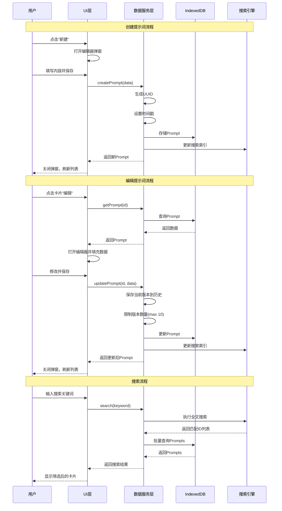
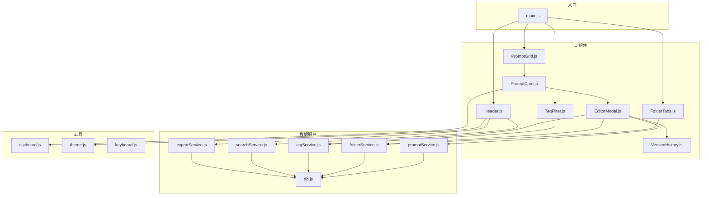

# PromptHub - 提示词管理器

> 产品需求文档 (PRD) v1.0
> 
> 创建日期：2025-12-11
> 
> 状态：已确认

---

## 1. 核心目标 (Mission)

> **为AI重度用户提供一个优雅、高效的本地提示词管理中心，让每一个精心打磨的Prompt都能被快速找到、轻松复用、持续迭代。**

---

## 2. 用户画像 (Persona)

| 属性 | 描述 |
|------|------|
| **身份** | AI工具重度用户（开发者、内容创作者、知识工作者） |
| **行为特征** | 每天与ChatGPT/Claude等AI交互，积累了大量有效提示词 |
| **核心痛点** | 提示词散落在各处（记事本、聊天记录、文件夹），难以检索和复用 |
| **期望价值** | 一个专属的"提示词知识库"，随用随取，持续进化 |

---

## 3. 版本规划

### 3.1 V1: 最小可行产品 (MVP)

| # | 功能 | 描述 |
|---|------|------|
| 1 | **提示词 CRUD** | 创建、查看、编辑、删除提示词 |
| 2 | **文件夹结构** | 层级分类组织（如"写作/博客"），支持拖拽移动 |
| 3 | **标签系统** | 一个提示词可打多个标签，标签可筛选 |
| 4 | **全文搜索** | 搜索标题 + 内容 + 标签 |
| 5 | **变量占位符** | 支持 `{变量名}` 语法高亮显示，复制时保留原样 |
| 6 | **一键复制** | 点击按钮或快捷键 `Ctrl/Cmd + C` 复制提示词内容 |
| 7 | **版本历史（简化版）** | 自动保存最近10个版本，可查看/恢复 |
| 8 | **本地存储** | 使用 IndexedDB 持久化数据 |
| 9 | **导入/导出** | 支持 JSON 格式批量导入导出 |
| 10 | **深色/浅色主题** | 适应不同使用环境 |

### 3.2 V2 及以后版本 (Future Releases)

| 版本 | 功能 | 描述 |
|------|------|------|
| V2 | **版本对比** | 差异高亮，查看每次修改的变化 |
| V2 | **变量填充模式** | 复制前弹出界面填写变量值 |
| V2 | **收藏/置顶** | 常用提示词快速访问 |
| V2 | **使用统计** | 记录每个提示词的使用次数和最后使用时间 |
| V2 | **Markdown 导入** | 支持从 .md 文件批量导入 |
| V3 | **云同步** | 多设备数据同步 |
| V3 | **浏览器插件** | 在AI网站中快速调用提示词 |
| V3 | **团队共享** | 多人协作管理提示词库 |
| V3 | **AI推荐** | 根据使用场景智能推荐提示词 |

---

## 4. 关键业务逻辑 (Business Rules)

| 规则 | 描述 |
|------|------|
| **R1: 文件夹层级** | 最多支持 3 层嵌套（根目录 → 一级 → 二级 → 三级） |
| **R2: 标签规范** | 标签名称唯一，长度限制 20 字符，每个提示词最多 10 个标签 |
| **R3: 变量语法** | 使用 `{variableName}` 格式，支持中英文变量名 |
| **R4: 版本保留** | 每次编辑自动创建新版本，保留最近 10 个版本，超出自动删除最旧版本 |
| **R5: 搜索逻辑** | 全文搜索匹配标题、内容、标签，按相关度排序 |
| **R6: 数据存储** | 所有数据存储在浏览器 IndexedDB，不上传任何服务器 |

---

## 5. 数据契约 (Data Contract)

### 5.1 核心数据模型

```typescript
// 提示词
interface Prompt {
  id: string;                    // UUID
  title: string;                 // 标题
  content: string;               // 提示词内容（支持变量占位符）
  folderId: string | null;       // 所属文件夹ID
  tags: string[];                // 标签ID列表
  createdAt: Date;               // 创建时间
  updatedAt: Date;               // 更新时间
  versions: PromptVersion[];     // 版本历史（最多10个）
}

// 版本历史
interface PromptVersion {
  id: string;                    // 版本ID
  content: string;               // 该版本内容
  createdAt: Date;               // 保存时间
}

// 文件夹
interface Folder {
  id: string;                    // UUID
  name: string;                  // 文件夹名称
  parentId: string | null;       // 父文件夹ID（null表示根目录）
  order: number;                 // 排序序号
}

// 标签
interface Tag {
  id: string;                    // UUID
  name: string;                  // 标签名称
  color: string;                 // 标签颜色（HEX）
}

// 导出格式
interface ExportData {
  version: string;               // 数据格式版本 "1.0"
  exportedAt: Date;              // 导出时间
  prompts: Prompt[];             // 所有提示词
  folders: Folder[];             // 所有文件夹
  tags: Tag[];                   // 所有标签
}
```

---

## 6. MVP 原型设计

### 6.1 设计方案：卡片式仪表盘 (Card Dashboard)

> **设计理念**：类似 Trello/Pinterest 的卡片网格布局，视觉化程度高，扫视效率好，现代感强。

**设计特点：**
- 顶部：Tab式文件夹切换 + 标签筛选器
- 主体：卡片网格，一目了然
- 编辑：弹窗/侧边抽屉模式
- 适合：喜欢视觉化、需要快速扫视的用户

### 6.2 原型图

```
┌─────────────────────────────────────────────────────────────────────────────────┐
│                                                                                 │
│   🗂️ PromptHub          🔍 搜索提示词...                        ☀️  ⚙️  + 新建 │
│                                                                                 │
├─────────────────────────────────────────────────────────────────────────────────┤
│                                                                                 │
│   📁 全部  │  📁 写作  │  📁 编程  │  📁 翻译  │  📁 分析  │    + 新建文件夹   │
│   ════════                                                                      │
│                                                                                 │
│   标签筛选：  ┌──────┐ ┌──────┐ ┌──────┐ ┌──────┐ ┌──────┐                      │
│              │ 全部  │ │#编程  │ │#翻译  │ │#写作  │ │#分析  │                      │
│              └──────┘ └──────┘ └──────┘ └──────┘ └──────┘                      │
│                                                                                 │
├─────────────────────────────────────────────────────────────────────────────────┤
│                                                                                 │
│   ┌─────────────────────┐  ┌─────────────────────┐  ┌─────────────────────┐    │
│   │                     │  │                     │  │                     │    │
│   │  📝 代码审查专家     │  │  📝 翻译助手        │  │  📝 博客大纲生成     │    │
│   │                     │  │                     │  │                     │    │
│   │  ─────────────────  │  │  ─────────────────  │  │  ─────────────────  │    │
│   │  你是一位资深代码   │  │  请将以下内容翻译   │  │  请为主题{topic}    │    │
│   │  审查专家，请审查   │  │  成{language}...    │  │  生成一篇博客大纲   │    │
│   │  以下代码：{code}   │  │                     │  │  ...                │    │
│   │                     │  │                     │  │                     │    │
│   │  ─────────────────  │  │  ─────────────────  │  │  ─────────────────  │    │
│   │  #编程  #审查       │  │  #翻译  #语言       │  │  #写作  #博客       │    │
│   │                     │  │                     │  │                     │    │
│   │  📋复制   ✏️编辑     │  │  📋复制   ✏️编辑     │  │  📋复制   ✏️编辑     │    │
│   └─────────────────────┘  └─────────────────────┘  └─────────────────────┘    │
│                                                                                 │
│   ┌─────────────────────┐  ┌─────────────────────┐  ┌─────────────────────┐    │
│   │                     │  │                     │  │                     │    │
│   │  📝 数据分析师       │  │  📝 会议纪要整理     │  │  📝 邮件润色        │    │
│   │                     │  │                     │  │                     │    │
│   │  ─────────────────  │  │  ─────────────────  │  │  ─────────────────  │    │
│   │  你是一位数据分析   │  │  请将以下会议内容   │  │  请帮我润色以下     │    │
│   │  专家，分析{data}   │  │  整理成纪要...      │  │  邮件内容...        │    │
│   │  ...                │  │                     │  │                     │    │
│   │  ─────────────────  │  │  ─────────────────  │  │  ─────────────────  │    │
│   │  #分析  #数据       │  │  #写作  #会议       │  │  #写作  #邮件       │    │
│   │                     │  │                     │  │                     │    │
│   │  📋复制   ✏️编辑     │  │  📋复制   ✏️编辑     │  │  📋复制   ✏️编辑     │    │
│   └─────────────────────┘  └─────────────────────┘  └─────────────────────┘    │
│                                                                                 │
└─────────────────────────────────────────────────────────────────────────────────┘
```

### 6.3 编辑器弹窗

```
┌─────────────────────────────────────────────┐
│      ✏️ 编辑提示词                     ✕    │
│  ─────────────────────────────────────────  │
│                                             │
│  标题                                       │
│  ┌───────────────────────────────────────┐  │
│  │ 代码审查专家                          │  │
│  └───────────────────────────────────────┘  │
│                                             │
│  文件夹                                     │
│  ┌───────────────────────────────────────┐  │
│  │ 📁 编程                          ▼   │  │
│  └───────────────────────────────────────┘  │
│                                             │
│  标签                                       │
│  ┌──────┐ ┌──────┐  + 添加标签             │
│  │#编程  │ │#审查  │                         │
│  └──────┘ └──────┘                         │
│                                             │
│  内容                                       │
│  ┌───────────────────────────────────────┐  │
│  │ 你是一位资深代码审查专家，拥有10年   │  │
│  │ 以上的软件开发经验。                 │  │
│  │                                       │  │
│  │ 请审查以下代码：                     │  │
│  │ {code}                                │  │
│  │                                       │  │
│  │ 请从以下几个方面进行审查：           │  │
│  │ 1. 代码可读性                        │  │
│  │ 2. 潜在Bug                           │  │
│  └───────────────────────────────────────┘  │
│                                             │
│  📜 版本历史                                │
│  ┌───────────────────────────────────────┐  │
│  │ v3 (当前) 今天 14:30                  │  │
│  │ v2        昨天 10:15         [恢复]   │  │
│  │ v1        3天前              [恢复]   │  │
│  └───────────────────────────────────────┘  │
│                                             │
│         ┌────────────┐  ┌────────────┐     │
│         │   取消     │  │   保存     │     │
│         └────────────┘  └────────────┘     │
└─────────────────────────────────────────────┘
```

---

## 7. 架构设计蓝图

### 7.1 技术选型

| 层级 | 技术选择 | 说明 |
|------|---------|------|
| **前端框架** | Vanilla JS + Vite | 轻量级，无依赖，快速启动 |
| **UI样式** | Vanilla CSS + CSS Variables | 支持主题切换，无构建依赖 |
| **本地存储** | IndexedDB (via Dexie.js) | 结构化存储，支持复杂查询 |
| **全文搜索** | FlexSearch | 轻量级全文搜索引擎 |
| **唯一ID** | nanoid | 轻量级UUID生成 |

### 7.2 核心流程图

#### 7.2.1 用户操作流程



#### 7.2.2 数据操作序列图



### 7.3 项目结构

```
prompt-hub/
├── index.html              # 主入口
├── vite.config.js          # Vite配置
├── package.json
│
├── src/
│   ├── main.js             # 应用入口
│   │
│   ├── styles/
│   │   ├── index.css       # 主样式入口
│   │   ├── variables.css   # CSS变量（主题）
│   │   ├── components.css  # 组件样式
│   │   └── utilities.css   # 工具类
│   │
│   ├── components/         # UI组件
│   │   ├── Header.js       # 顶部导航
│   │   ├── FolderTabs.js   # 文件夹Tab
│   │   ├── TagFilter.js    # 标签筛选器
│   │   ├── PromptCard.js   # 提示词卡片
│   │   ├── PromptGrid.js   # 卡片网格
│   │   ├── EditorModal.js  # 编辑器弹窗
│   │   ├── VersionHistory.js # 版本历史
│   │   └── Toast.js        # 消息提示
│   │
│   ├── services/           # 数据服务
│   │   ├── db.js           # IndexedDB封装 (Dexie)
│   │   ├── promptService.js # 提示词CRUD
│   │   ├── folderService.js # 文件夹管理
│   │   ├── tagService.js   # 标签管理
│   │   ├── searchService.js # 搜索服务
│   │   └── exportService.js # 导入导出
│   │
│   ├── utils/
│   │   ├── uuid.js         # ID生成
│   │   ├── clipboard.js    # 剪贴板操作
│   │   ├── theme.js        # 主题切换
│   │   └── keyboard.js     # 快捷键
│   │
│   └── constants/
│       └── config.js       # 配置常量
│
└── public/
    └── favicon.svg         # 图标
```

### 7.4 组件交互关系



### 7.5 技术风险与对策

| 风险 | 影响 | 对策 |
|------|------|------|
| **IndexedDB存储限制** | 浏览器存储空间有限（通常50MB-无限） | 1. 监控存储使用量 2. 提示用户导出备份 3. 后续版本考虑云同步 |
| **全文搜索性能** | 大量提示词时搜索可能变慢 | 1. 使用FlexSearch异步搜索 2. 实现搜索防抖 3. 分页加载结果 |
| **数据丢失风险** | 用户清除浏览器数据会丢失 | 1. 启动时检测数据 2. 定期提醒导出 3. 考虑自动备份到下载文件夹 |
| **跨浏览器兼容** | 不同浏览器IndexedDB实现有差异 | 1. 使用Dexie.js抽象层 2. 测试主流浏览器 |
| **版本历史存储膨胀** | 频繁编辑可能导致版本过多 | 1. 严格限制10个版本 2. 只保存内容差异（V2优化） |

---

## 8. 附录

### 8.1 快捷键设计

| 快捷键 | 功能 |
|--------|------|
| `Ctrl/Cmd + N` | 新建提示词 |
| `Ctrl/Cmd + F` | 聚焦搜索框 |
| `Ctrl/Cmd + S` | 保存当前编辑 |
| `Esc` | 关闭弹窗 |
| `Enter` (卡片选中时) | 复制提示词内容 |

### 8.2 主题色板

**浅色主题：**
- 背景：`#F8FAFC`
- 卡片：`#FFFFFF`
- 主色：`#6366F1` (Indigo)
- 文字：`#1E293B`

**深色主题：**
- 背景：`#0F172A`
- 卡片：`#1E293B`
- 主色：`#818CF8` (Indigo Light)
- 文字：`#F1F5F9`

---

> 📋 **文档状态**：已确认锁定，等待开发启动

